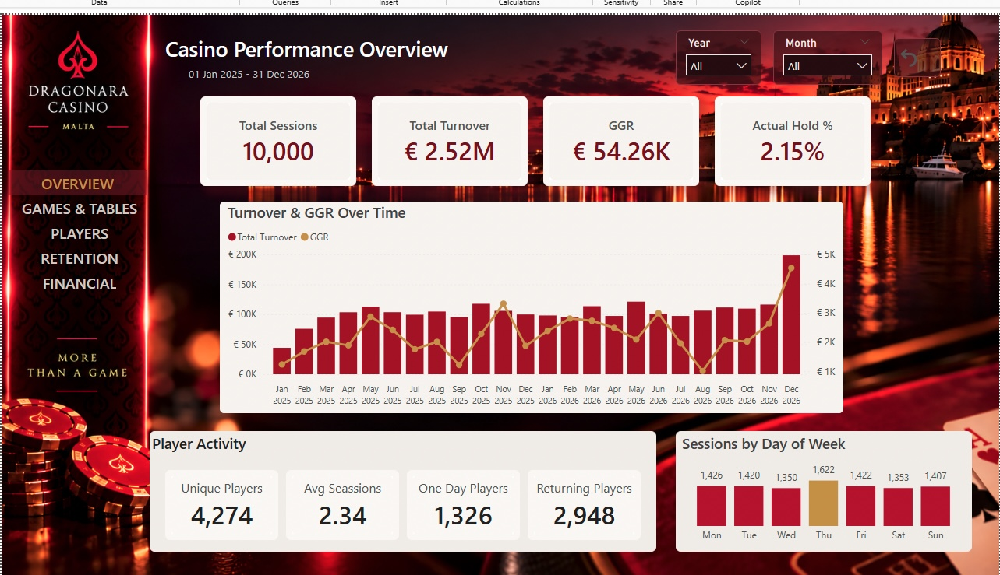

# 🎰 Casino Gaming Analytics | SQL & Power BI

## Project Overview

This project simulates an end-to-end casino analytics environment designed to analyze gaming performance, player behaviour, retention, financial flows, and operational activity.

A simulated relational casino database was created in SQL Server and subsequently refined to create more realistic relationships and behavioural patterns for analysis. SQL was then used to prepare the data for Power BI, where the analytical model, DAX measures, and interactive dashboard were developed.

The final Power BI report consists of five analytical pages covering overall casino performance, games and tables, player behaviour, retention, and financial & operational performance.

> **Note:** This project uses simulated data created for portfolio and educational purposes. It does not contain real casino or customer data.

---

## 🛠 Tools & Technologies

- **SQL Server** — relational database and data preparation
- **SQL** — data extraction and transformations
- **Power BI** — data modelling, analysis and dashboard development
- **DAX** — business metrics, retention analysis and operational KPIs

---

## 🔄 Project Workflow

**Simulated Database → SQL Server → Power BI Data Model → DAX → Dashboard → Business Analysis**

The SQL layer prepares the fact and dimension tables used by the Power BI model. Transformations include field selection, player and dealer name construction, country standardization, and creation of a custom VIP-level sort order.

The analytical model in Power BI connects sessions and transactions with player, game, table, dealer and date dimensions.

---

## 🎯 Business Questions

The analysis was designed around several business questions:

- How is overall casino performance evolving over time?
- Which games and tables generate the highest turnover and GGR?
- How does Hold % vary across games?
- How does player behaviour differ by VIP level?
- Who are the highest-value players?
- What percentage of players return after their first visit?
- How does cohort retention develop over subsequent months?
- What are the busiest operating periods?
- How do deposits, withdrawals and net cash flow evolve over time?
- How efficiently are casino tables utilized?

---

# 📊 Dashboard

## 1. Casino Overview

Provides a high-level view of casino activity and performance, combining key KPIs with trends across games, sessions and players.



---

## 2. Games & Table Performance

Analyzes gaming performance across individual games, tables and studios.

The page compares **Turnover, GGR and Hold %** to show that high betting volume does not necessarily translate into the highest gaming revenue. It also identifies the top-performing game and table dynamically based on the selected filters.


---

## 3. Player Analytics

Explores the casino player base through VIP segmentation, geography, spending behaviour and player value.

The analysis compares the distribution of players across VIP tiers with their contribution to Turnover and GGR, while also identifying top players and distinguishing between one-day and returning players.


---

## 4. Retention & Player Behaviour

Focuses on repeat activity and player lifecycle behaviour.

The page includes:

- Returning Players and Retention Rate
- Average Sessions per Player
- Average Days Between Visits
- Player Status
- Session-frequency lifecycle
- Cohort Retention Analysis

The cohort matrix tracks player activity from the initial cohort month (**M0**) through subsequent months, making it possible to observe how retention changes over time.


---

## 5. Financial & Operational Analysis

Combines financial performance with casino operational activity.

Financial metrics include **Deposits, Withdrawals, Net Cash Flow, GGR and Hold %**, while operational metrics track table activity, sessions per table, average session length and average bet per session.

A peak-hours heatmap is used to identify periods with the highest session activity across days of the week and time slots.


---

# 🧠 Key Analytical Findings

The dashboard highlights several patterns within the simulated dataset:

**Player retention:**  
Approximately **69% of players returned**, while player activity declined progressively as the required number of sessions increased.

**VIP contribution:**  
Gold and Platinum players represented a smaller portion of the overall player base but generated a substantial share of casino turnover.

**Game performance:**  
Turnover, GGR and Hold % produced different rankings across games, illustrating why gaming performance should not be evaluated using betting volume alone.

**Player lifecycle:**  
Cohort analysis showed a progressive decline in player activity during the months following the initial registration period.

**Operational activity:**  
Session activity varied considerably across days and time periods, with the peak-hours analysis highlighting periods of higher casino activity.

---

# 🗃 Data Model

The Power BI model separates transactional activity from descriptive dimensions, allowing casino performance to be analyzed across players, games, tables, dealers and time.

Main model components include:

- `FactSessions`
- `FactTransactions`
- `DimPlayers`
- `DimGames`
- `DimTables`
- `DimDealers`
- `DimDate`
- `_Measures`


---

# 💻 SQL

SQL Server was used to store the simulated casino database and prepare the fact and dimension tables used by the Power BI model.

The SQL queries used for the Power BI data model are available here:

[`power-bi-data-model.sql`](power-bi-data-model.sql)

---

# 📐 DAX

DAX measures were created for financial performance, gaming metrics, player behaviour, retention and operational analysis.

Examples include:

- Total Turnover
- GGR
- Actual Hold %
- Net Cash Flow
- Returning Players
- Retention Rate
- Average Days Between Visits
- Cohort Retention %
- Top Game
- Players % by VIP Level
- Average Session Length
- Sessions per Table

Selected measures used in the analysis are available here:

[`key-measures.dax`](key-measures.dax)

---

## 📁 Repository Structure

```text
Casino-Gaming-Analytics/
│
├── Casino-Gaming-Analytics.pbix
├── power-bi-data-model.sql
├── key-measures.dax
├── README.md
│
└── images/
    ├── 1.Overview.jpg
    ├── 2.Game & Table Performance.jpg
    ├── 3.Player Analytics.jpg
    ├── 4.Retention & Player Behaviour.jpg
    ├── 5.Financial & Operational Analysis.jpg
    └── 6.Model View.jpg
```

---

## About This Project

This project was developed as part of my transition into Data Analytics and combines technical data skills with my professional experience in the casino industry.

The objective was not only to build a dashboard, but to structure the analysis around business questions that are relevant to casino operations, player behaviour and gaming performance.
