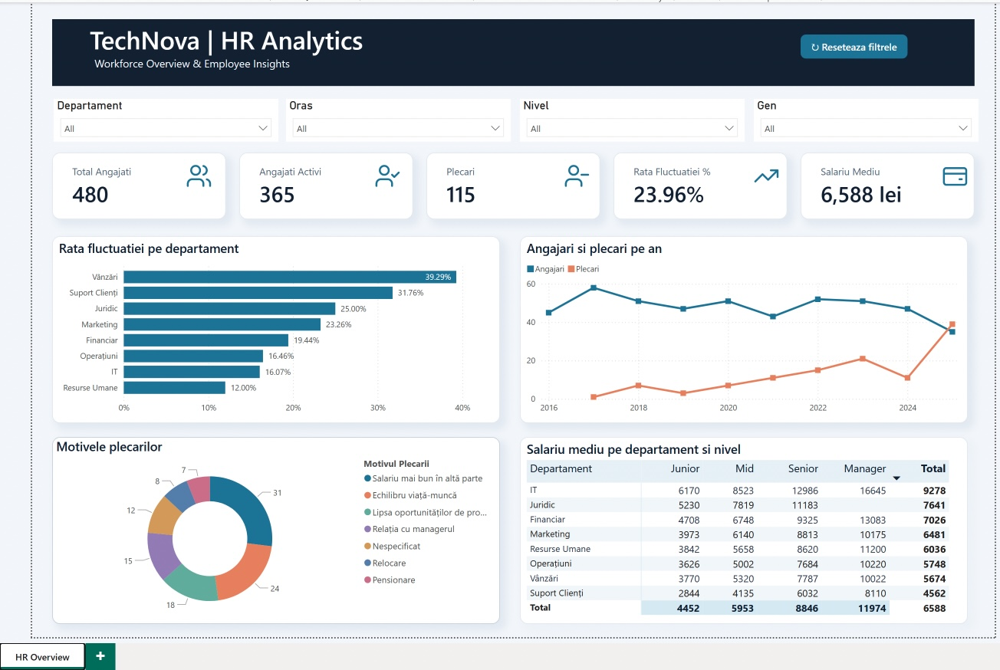

# TechNova Solutions | HR Analytics

**Proiect final Data Analyst – Anda Ignat**

## Despre proiect

Analiza fluctuației de personal într-o companie fictivă, folosind **Excel, Python, SQL Server și Power BI**.

Obiectivul este identificarea factorilor asociați plecărilor angajaților și formularea unor recomandări pentru departamentul HR.

Datele includ 480 de angajați, 8 departamente și evaluări de performanță și satisfacție.

## Pregătirea și analiza datelor

- **Excel:** eliminarea duplicatelor, corectarea salariilor, standardizarea datelor și completarea valorilor lipsă.
- **Python (pandas, matplotlib):** analiză exploratorie, comparații între angajații activi și plecați, vizualizări.
- **SQL Server:** 12 interogări pentru analiza indicatorilor HR.
- **Power BI:** dashboard interactiv cu măsuri DAX, KPI-uri și filtre.

## Rezultate principale

**480 angajați | 115 plecări | Rata fluctuației: 23,96%**

1. **Unde se înregistrează cele mai multe plecări?** Vânzări (39,29%) și Suport Clienți (31,76%) au cele mai mari rate de fluctuație. Juniorii înregistrează 29,94%.

2. **Ce diferențiază angajații plecați de cei activi?** Cei plecați au satisfacție mai mică (6,00 față de 6,57), vechime mai redusă (2,57 față de 5,16 ani) și mai multe ore suplimentare lunar (10,46 față de 7,22).

3. **De ce pleacă angajații?** Principalele motive sunt salariile mai bune (31 cazuri), echilibrul viață–muncă (24) și lipsa promovării (18).

4. **Există diferențe salariale?** IT are cel mai mare salariu mediu (9.278 lei), iar Suport Clienți cel mai mic (4.562 lei). Salariul mediu este de aproximativ 6.361 lei pentru femei și 6.848 lei pentru bărbați; diferența nu este ajustată pentru funcție sau nivel.

5. **Ce poate îmbunătăți compania?** Prioritizarea retenției în departamentele cu fluctuație ridicată și în rândul angajaților Junior.

## Recomandări HR

1. **Revizuirea salariilor** în departamentele cu fluctuație ridicată, având în vedere cele 31 de plecări motivate salarial.
2. **Monitorizarea orelor suplimentare și a satisfacției**, deoarece angajații plecați au înregistrat în medie mai multe ore suplimentare.
3. **Programe de mentorat și promovare pentru Juniori**, categoria cu cea mai mare rată de plecare.

## Dashboard Power BI

Dashboardul permite filtrarea după departament, oraș, nivel profesional și gen.

## Fișiere și rulare

| Fișier | Conținut |
|---|---|
| `date/` | Date CSV originale și curățate |
| `01_Excel_curatare.xlsx` | Curățarea datelor |
| `02_Python_analiza.ipynb` | Analiza Python – se rulează în Jupyter |
| `03_SQL_interogari.sql` | Interogări pentru SQL Server |
| `04_PowerBI_dashboard.pbix` | Dashboard – se deschide în Power BI Desktop |
| `capturi/` | Rezultate SQL și capturi Power BI |

